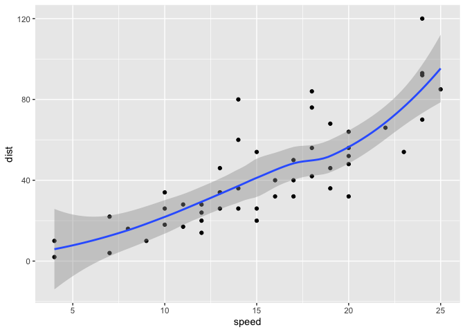
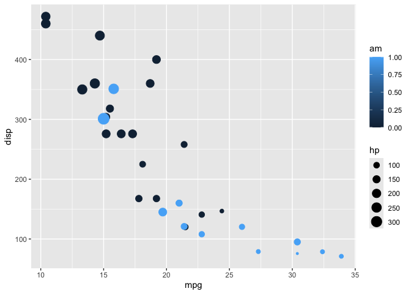
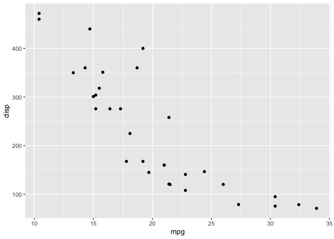

# Class 5: Data Viz with ggplot
Barry (PID: 911)

R has lot’s of ways to make figures and graphs in particular. One that
comes with R out of the box is called **“base” R** - the `plot()`
function.

``` r
plot(cars)
```


A very popular package in this area is called **ggplot2**.

Before I can use any add-on package like this I must install it with the
`install.packages("ggplot2")` command/function.

Then to use the package I need to load it with a `library(ggplot2)`
call.

``` r
library(ggplot2)

ggplot(cars) +
  aes(x=speed, y=dist) +
  geom_point()
```


For “simple” plots like this one base R code will be much shorter than
ggplot code.

Let’s fit a model and show it on my plot:

``` r
ggplot(cars) +
  aes(x=speed, y=dist) +
  geom_point() +
  geom_smooth() 
```

    `geom_smooth()` using method = 'loess' and formula = 'y ~ x'



Every ggplot has at least 3 layers

- **data** (data.frame with the numbers and stuff you want to plot)
- **aes**thetics (mapping of your data columns to your plot)
- **geom**s (there are tones of these, basics are `geom_point()`,
  `geom_line()`, `geom_col()`)

``` r
head(mtcars)
```

                       mpg cyl disp  hp drat    wt  qsec vs am gear carb
    Mazda RX4         21.0   6  160 110 3.90 2.620 16.46  0  1    4    4
    Mazda RX4 Wag     21.0   6  160 110 3.90 2.875 17.02  0  1    4    4
    Datsun 710        22.8   4  108  93 3.85 2.320 18.61  1  1    4    1
    Hornet 4 Drive    21.4   6  258 110 3.08 3.215 19.44  1  0    3    1
    Hornet Sportabout 18.7   8  360 175 3.15 3.440 17.02  0  0    3    2
    Valiant           18.1   6  225 105 2.76 3.460 20.22  1  0    3    1

Make me a ggplot of the `mtcars` data set using `mpg` vs `disp` and set
the size of the points to the `hp` and set the color to `am`

``` r
ggplot(mtcars) +
  aes(x=mpg, y=disp, size=hp, col=am) +
  geom_point()
```



## Gene expression plot

``` r
url <- "https://bioboot.github.io/bimm143_S20/class-material/up_down_expression.txt"
genes <- read.delim(url)
head(genes)
```

            Gene Condition1 Condition2      State
    1      A4GNT -3.6808610 -3.4401355 unchanging
    2       AAAS  4.5479580  4.3864126 unchanging
    3      AASDH  3.7190695  3.4787276 unchanging
    4       AATF  5.0784720  5.0151916 unchanging
    5       AATK  0.4711421  0.5598642 unchanging
    6 AB015752.4 -3.6808610 -3.5921390 unchanging

``` r
nrow(genes)
```

    [1] 5196

There are 5196 genes in this dataset.

``` r
unique(genes$State)
```

    [1] "unchanging" "up"         "down"      

The `table()` function is a super useful utility to tell me how many
entries of each type there are.

``` r
round( table(genes$State) / nrow(genes), 3)
```


          down unchanging         up 
         0.014      0.962      0.024 

The functions `nrow()`, `ncol()`, and `table()` are ones I want you to
know.

> Key points: Saving plots with **ggsave()** Different plot “types” with
> different `geoms_**()` Faceting with `facet_wrap()` Multi-plot layout
> with the **patchwork** package.

``` r
p <- ggplot(mtcars) +
  aes(mpg, disp) +
  geom_point()

#ggsave("myplot.pdf")
```

``` r
p
```


