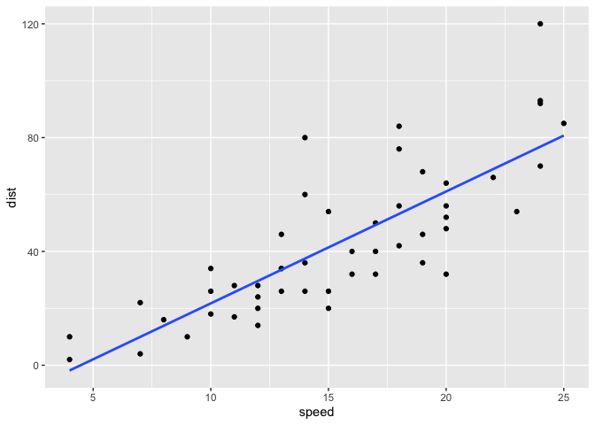
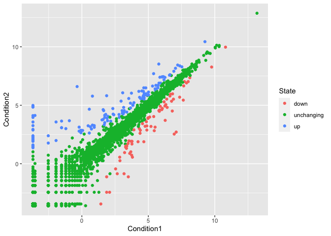
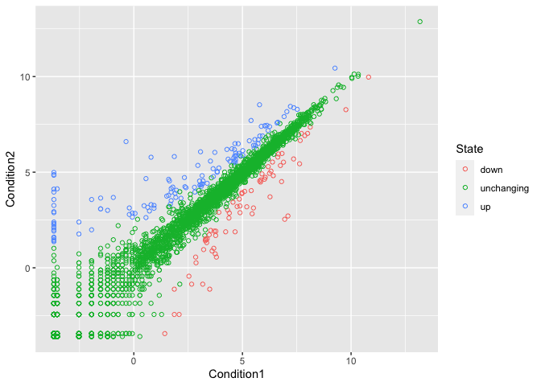
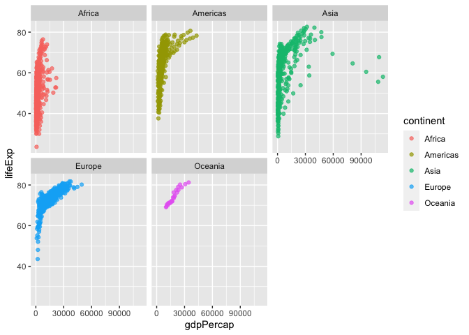

Class 5: Data Visualization
================
Barry

# Plotting in R

R has many plotting and visualization systems including “base” R.

``` r
head(cars, n=6)
```

      speed dist
    1     4    2
    2     4   10
    3     7    4
    4     7   22
    5     8   16
    6     9   10

## A base plot

``` r
plot(cars)
```


Base R plots can be quite simple for basic plots when compared to
systems like ggplot.

To use an add on package, like ggplot, I have to first get it on my
computer - i.e. install it!

We use the function `install.packages()` with the name of the package we
want to install.

``` r
library(ggplot2)
ggplot(cars)
```


ggplot is much more verbose than base R plot and every single ggplot
needs at least 3 things:

- **Data** (this is the data.frame with the stuff we want to plot)
- **Aesthetics** or aes() for short (how the data map to the plot)
- **Geoms** (like geom_point(), geom_line() the plot type)

``` r
ggplot(cars) +
  aes(x=speed, y=dist) +
  geom_point() +
  theme_bw()
```


``` r
ggplot(cars) +
  aes(x=speed, y=dist) +
  geom_point() +
  geom_smooth(se=FALSE, method="lm")
```

    `geom_smooth()` using formula = 'y ~ x'



## A plot of some gene expresion data

The code to read the data:

``` r
url <- "https://bioboot.github.io/bimm143_S20/class-material/up_down_expression.txt"

genes <- read.delim(url)

head(genes)
```

            Gene Condition1 Condition2      State
    1      A4GNT -3.6808610 -3.4401355 unchanging
    2       AAAS  4.5479580  4.3864126 unchanging
    3      AASDH  3.7190695  3.4787276 unchanging
    4       AATF  5.0784720  5.0151916 unchanging
    5       AATK  0.4711421  0.5598642 unchanging
    6 AB015752.4 -3.6808610 -3.5921390 unchanging

> Q. How many genes are in this dataset?

``` r
nrow(genes)
```

    [1] 5196

There are 5196 genes in this dataset.

> How many genes are up-regulated?

``` r
table( genes$State )
```


          down unchanging         up 
            72       4997        127 

``` r
sum(genes$State == "up")
```

    [1] 127

Let’s stop messing and plot it

``` r
ggplot(genes) +
  aes(x=Condition1, y=Condition2, color=State) +
  geom_point()
```


I can save any ggplot object for use later so I don’t need to type it
all out again. Here I save my starting plot to the object `p` then I can
add layers to `p` later on.

``` r
p <- ggplot(genes) + 
    aes(x=Condition1, y=Condition2, col=State) +
    geom_point()
```

``` r
p + scale_colour_manual( values=c("blue","gray","red") ) +
  labs(title="Gene expresion changes upon drug treatment",
       subtitle = "Some subtitle")
```


My object `p` is just the same.

``` r
p
```



``` r
ggplot(genes) +
  aes(x=Condition1, y=Condition2, color=State) +
  geom_point(shape=21)
```



## A more complex ggplot example

One of the big wins with ggplot is how easy it is to facet your data
into sub-plots..

Read the gapminder dataset from online

``` r
# File location online
url <- "https://raw.githubusercontent.com/jennybc/gapminder/master/inst/extdata/gapminder.tsv"

gapminder <- read.delim(url)
```

and have a wee peak

``` r
head(gapminder)
```

          country continent year lifeExp      pop gdpPercap
    1 Afghanistan      Asia 1952  28.801  8425333  779.4453
    2 Afghanistan      Asia 1957  30.332  9240934  820.8530
    3 Afghanistan      Asia 1962  31.997 10267083  853.1007
    4 Afghanistan      Asia 1967  34.020 11537966  836.1971
    5 Afghanistan      Asia 1972  36.088 13079460  739.9811
    6 Afghanistan      Asia 1977  38.438 14880372  786.1134

> Q. How many countrys are in this dataset?

``` r
length( unique(gapminder$country) )
```

    [1] 142

> Q. How many years do we have data for?

``` r
min(gapminder$year)
```

    [1] 1952

``` r
max(gapminder$year)
```

    [1] 2007

``` r
range(gapminder$year)
```

    [1] 1952 2007

> Q. Which country has the smallest population in the dataset?

``` r
min(gapminder$pop)
```

    [1] 60011

First where is this min value in the pop vector

``` r
ind <- which.min(gapminder$pop)
```

Now use this to access the \$country value for this position

``` r
gapminder$country[ind]
```

    [1] "Sao Tome and Principe"

``` r
gapminder[ind,]
```

                       country continent year lifeExp   pop gdpPercap
    1297 Sao Tome and Principe    Africa 1952  46.471 60011  879.5836

Make a first plot of gdb vs life exp

``` r
ggplot(gapminder) +
  aes(x=gdpPercap, y=lifeExp, color=continent) +
  geom_point(alpha=0.7) +
  facet_wrap(~continent)
```


