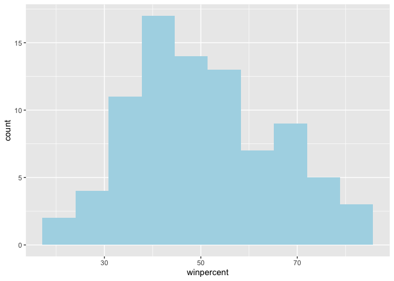
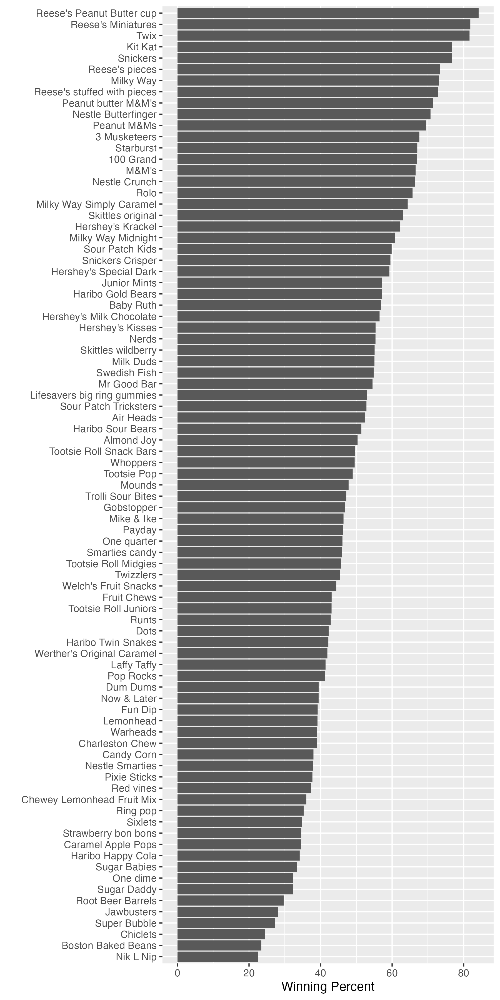
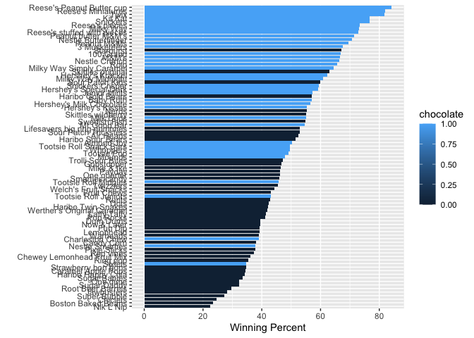
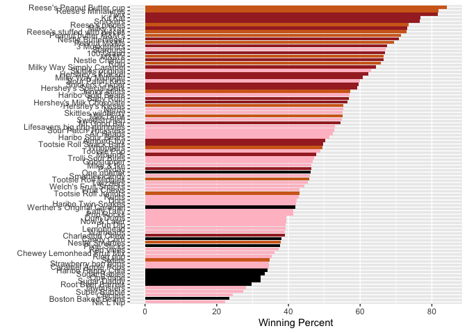
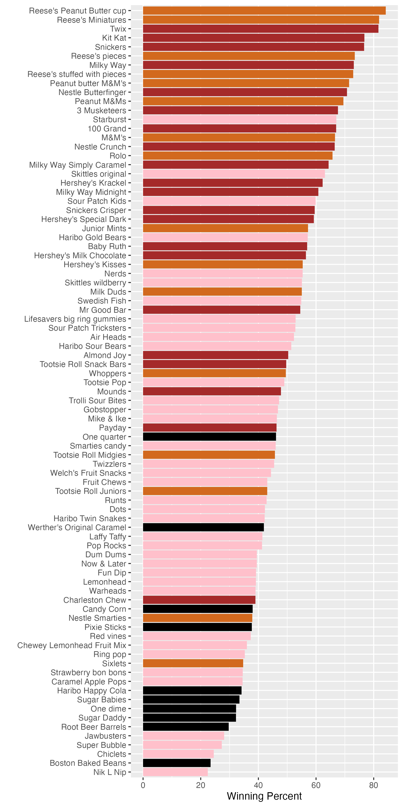
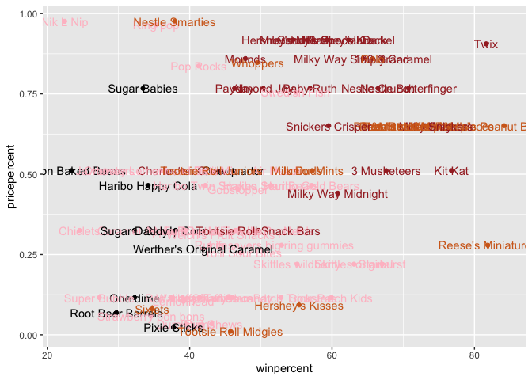
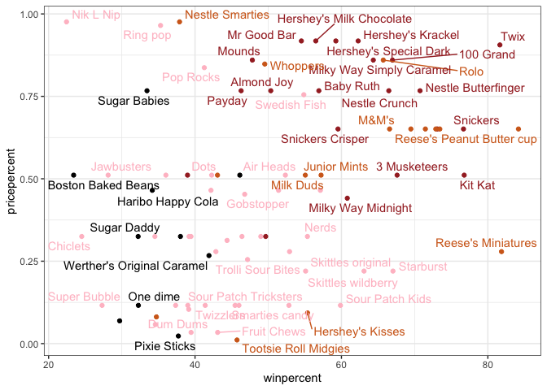
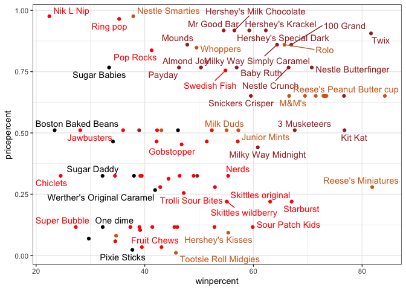
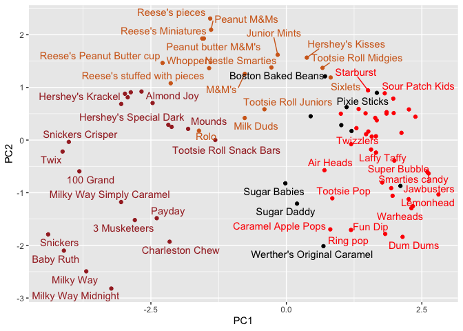
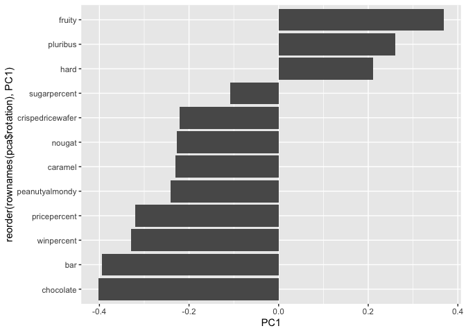

# Class 9: Halloween Candy Project
Barry (PID: 911)

- [Background](#background)
- [Import the data](#import-the-data)
- [What is your favorate candy?](#what-is-your-favorate-candy)
- [3. Overall Candy Rankings](#3-overall-candy-rankings)
- [4. Taking a look at pricepercent](#4-taking-a-look-at-pricepercent)
- [5 Exploring the correlation
  structure](#5-exploring-the-correlation-structure)
- [6 Principal Component Analysis
  (PCA)](#6-principal-component-analysis-pca)

## Background

Today we are delving into an analysis of Halloween Candy data using
ggplot, dplyr, basic stats, correlation analysis, and our old friend
PCA.

## Import the data

``` r
candy <- read.csv("candy-data.csv", row.names=1)
head(candy)
```

                 chocolate fruity caramel peanutyalmondy nougat crispedricewafer
    100 Grand            1      0       1              0      0                1
    3 Musketeers         1      0       0              0      1                0
    One dime             0      0       0              0      0                0
    One quarter          0      0       0              0      0                0
    Air Heads            0      1       0              0      0                0
    Almond Joy           1      0       0              1      0                0
                 hard bar pluribus sugarpercent pricepercent winpercent
    100 Grand       0   1        0        0.732        0.860   66.97173
    3 Musketeers    0   1        0        0.604        0.511   67.60294
    One dime        0   0        0        0.011        0.116   32.26109
    One quarter     0   0        0        0.011        0.511   46.11650
    Air Heads       0   0        0        0.906        0.511   52.34146
    Almond Joy      0   1        0        0.465        0.767   50.34755

> Q1. How many candy types are in this dataset?

``` r
nrow(candy)
```

    [1] 85

> Q2. How many fruity candy types are in the dataset?

``` r
sum(candy$fruity)
```

    [1] 38

> Q. How many chocolate candy types are in the dataset?

``` r
sum(candy$chocolate)
```

    [1] 37

## What is your favorate candy?

``` r
candy["Twix", c("winpercent", "sugarpercent")]
```

         winpercent sugarpercent
    Twix   81.64291        0.546

``` r
candy["Twix",]$winpercent
```

    [1] 81.64291

``` r
library(dplyr)
```

We can also use the `filter()` and `select()` functions from **dplyr**.

``` r
candy |>
  filter(rownames(candy) == "Twix") |>
  select(winpercent, sugarpercent)
```

         winpercent sugarpercent
    Twix   81.64291        0.546

``` r
candy |>
  filter(rownames(candy) == "Nerds") |>
  select(winpercent, sugarpercent)
```

          winpercent sugarpercent
    Nerds   55.35405        0.848

``` r
candy |>
  filter(rownames(candy) == "Almond Joy") |>
  select(winpercent, sugarpercent)
```

               winpercent sugarpercent
    Almond Joy   50.34755        0.465

``` r
candy |>
  filter(rownames(candy) == "Swedish Fish") |>
  select(winpercent, sugarpercent)
```

                 winpercent sugarpercent
    Swedish Fish   54.86111        0.604

A useful function for a quick look at a new dataset is found in the
**skimr** package:

``` r
skimr::skim(candy)
```

|                                                  |       |
|:-------------------------------------------------|:------|
| Name                                             | candy |
| Number of rows                                   | 85    |
| Number of columns                                | 12    |
| \_\_\_\_\_\_\_\_\_\_\_\_\_\_\_\_\_\_\_\_\_\_\_   |       |
| Column type frequency:                           |       |
| numeric                                          | 12    |
| \_\_\_\_\_\_\_\_\_\_\_\_\_\_\_\_\_\_\_\_\_\_\_\_ |       |
| Group variables                                  | None  |

Data summary

**Variable type: numeric**

| skim_variable | n_missing | complete_rate | mean | sd | p0 | p25 | p50 | p75 | p100 | hist |
|:---|---:|---:|---:|---:|---:|---:|---:|---:|---:|:---|
| chocolate | 0 | 1 | 0.44 | 0.50 | 0.00 | 0.00 | 0.00 | 1.00 | 1.00 | ▇▁▁▁▆ |
| fruity | 0 | 1 | 0.45 | 0.50 | 0.00 | 0.00 | 0.00 | 1.00 | 1.00 | ▇▁▁▁▆ |
| caramel | 0 | 1 | 0.16 | 0.37 | 0.00 | 0.00 | 0.00 | 0.00 | 1.00 | ▇▁▁▁▂ |
| peanutyalmondy | 0 | 1 | 0.16 | 0.37 | 0.00 | 0.00 | 0.00 | 0.00 | 1.00 | ▇▁▁▁▂ |
| nougat | 0 | 1 | 0.08 | 0.28 | 0.00 | 0.00 | 0.00 | 0.00 | 1.00 | ▇▁▁▁▁ |
| crispedricewafer | 0 | 1 | 0.08 | 0.28 | 0.00 | 0.00 | 0.00 | 0.00 | 1.00 | ▇▁▁▁▁ |
| hard | 0 | 1 | 0.18 | 0.38 | 0.00 | 0.00 | 0.00 | 0.00 | 1.00 | ▇▁▁▁▂ |
| bar | 0 | 1 | 0.25 | 0.43 | 0.00 | 0.00 | 0.00 | 0.00 | 1.00 | ▇▁▁▁▂ |
| pluribus | 0 | 1 | 0.52 | 0.50 | 0.00 | 0.00 | 1.00 | 1.00 | 1.00 | ▇▁▁▁▇ |
| sugarpercent | 0 | 1 | 0.48 | 0.28 | 0.01 | 0.22 | 0.47 | 0.73 | 0.99 | ▇▇▇▇▆ |
| pricepercent | 0 | 1 | 0.47 | 0.29 | 0.01 | 0.26 | 0.47 | 0.65 | 0.98 | ▇▇▇▇▆ |
| winpercent | 0 | 1 | 50.32 | 14.71 | 22.45 | 39.14 | 47.83 | 59.86 | 84.18 | ▃▇▆▅▂ |

> Q6. Is there any variable/column that looks to be on a different scale
> to the majority of the other columns in the dataset?

Absolutely-tootley the `winpercent` column is on a different “scale” or
range than all the others.

**N.B** Wee will need to scale this data before analysis like PCA for
example to avoid this one variable dominating our analysis.

> Q7. What do you think a zero and one represent for the
> candy\$chocolate column?

That the candy has no chocolate…

> Q8. Plot a histogram of winpercent values using base R and ggplot.

``` r
hist(candy$winpercent)
```


``` r
library(ggplot2)

ggplot(candy) +
  aes(winpercent) +
  geom_histogram(bins=10, fill="lightblue")
```



> Q9. Is the distribution of winpercent values symmetrical?

No

> Q10. Is the center of the distribution above or below 50%?

From the histogram it looks to be below the 50% mark

``` r
summary(candy$winpercent)
```

       Min. 1st Qu.  Median    Mean 3rd Qu.    Max. 
      22.45   39.14   47.83   50.32   59.86   84.18 

> Q11. On average is chocolate candy higher or lower ranked than fruit
> candy?

Step 1. Find/extract chocolate candy rows in the dataset. Step 2. Get
their `winpercent` values Step 3. Calculate their mean `winpercent`

Step 4. Find/extract fruity candy Step 5. Get their `winpercent` values
Step 6. Calculate their mean `winpercent`

Step 7. Compare mean chocolate `winpercent` to mean fruity `winpercent`
and see which one is larger.

1.  Find chocolate candy

``` r
choc.inds   <- candy$chocolate == 1
choc.candy <- candy[ choc.inds,  ]
```

2.  Get their winpercent values

``` r
choc.win <- choc.candy$winpercent
```

3.  Get their mean

``` r
mean(choc.win)
```

    [1] 60.92153

4-6 do the same for fruity candy

``` r
fruit.inds <- as.logical(candy$fruity)
fruit.candy <- candy[fruit.inds, ]
fruit.win  <- fruit.candy$winpercent
mean(fruit.win)
```

    [1] 44.11974

> Q12. Is this difference statistically significant?

Let’s use a t.test

``` r
t.test(choc.win, fruit.win)
```


        Welch Two Sample t-test

    data:  choc.win and fruit.win
    t = 6.2582, df = 68.882, p-value = 2.871e-08
    alternative hypothesis: true difference in means is not equal to 0
    95 percent confidence interval:
     11.44563 22.15795
    sample estimates:
    mean of x mean of y 
     60.92153  44.11974 

## 3. Overall Candy Rankings

> Q13. What are the five least liked candy types in this set?

``` r
#sort(candy$winpercent)

x <- c(10, 1, 100)
sort(x)
```

    [1]   1  10 100

``` r
order(x)
```

    [1] 2 1 3

So I can use the output of `order(winpercent)` to re-arrange (or order)
my whole dataset by `winpercent`

``` r
ord.inds <- order(candy$winpercent)
head( candy[ord.inds, ] , 5)
```

                       chocolate fruity caramel peanutyalmondy nougat
    Nik L Nip                  0      1       0              0      0
    Boston Baked Beans         0      0       0              1      0
    Chiclets                   0      1       0              0      0
    Super Bubble               0      1       0              0      0
    Jawbusters                 0      1       0              0      0
                       crispedricewafer hard bar pluribus sugarpercent pricepercent
    Nik L Nip                         0    0   0        1        0.197        0.976
    Boston Baked Beans                0    0   0        1        0.313        0.511
    Chiclets                          0    0   0        1        0.046        0.325
    Super Bubble                      0    0   0        0        0.162        0.116
    Jawbusters                        0    1   0        1        0.093        0.511
                       winpercent
    Nik L Nip            22.44534
    Boston Baked Beans   23.41782
    Chiclets             24.52499
    Super Bubble         27.30386
    Jawbusters           28.12744

``` r
candy |>
  arrange(winpercent) |>
  head()
```

                       chocolate fruity caramel peanutyalmondy nougat
    Nik L Nip                  0      1       0              0      0
    Boston Baked Beans         0      0       0              1      0
    Chiclets                   0      1       0              0      0
    Super Bubble               0      1       0              0      0
    Jawbusters                 0      1       0              0      0
    Root Beer Barrels          0      0       0              0      0
                       crispedricewafer hard bar pluribus sugarpercent pricepercent
    Nik L Nip                         0    0   0        1        0.197        0.976
    Boston Baked Beans                0    0   0        1        0.313        0.511
    Chiclets                          0    0   0        1        0.046        0.325
    Super Bubble                      0    0   0        0        0.162        0.116
    Jawbusters                        0    1   0        1        0.093        0.511
    Root Beer Barrels                 0    1   0        1        0.732        0.069
                       winpercent
    Nik L Nip            22.44534
    Boston Baked Beans   23.41782
    Chiclets             24.52499
    Super Bubble         27.30386
    Jawbusters           28.12744
    Root Beer Barrels    29.70369

> Q14. What are the top 5 all time favorite candy types out of this set?

``` r
candy |>
  arrange(-winpercent) |>
  head(5)
```

                              chocolate fruity caramel peanutyalmondy nougat
    Reese's Peanut Butter cup         1      0       0              1      0
    Reese's Miniatures                1      0       0              1      0
    Twix                              1      0       1              0      0
    Kit Kat                           1      0       0              0      0
    Snickers                          1      0       1              1      1
                              crispedricewafer hard bar pluribus sugarpercent
    Reese's Peanut Butter cup                0    0   0        0        0.720
    Reese's Miniatures                       0    0   0        0        0.034
    Twix                                     1    0   1        0        0.546
    Kit Kat                                  1    0   1        0        0.313
    Snickers                                 0    0   1        0        0.546
                              pricepercent winpercent
    Reese's Peanut Butter cup        0.651   84.18029
    Reese's Miniatures               0.279   81.86626
    Twix                             0.906   81.64291
    Kit Kat                          0.511   76.76860
    Snickers                         0.651   76.67378

> Q15. Make a first barplot of candy ranking based on winpercent values.

``` r
ggplot(candy) +
  aes(winpercent, rownames(candy)) +
  geom_col() 
```


We can make this plot better by rearrange (with the `reorder()`
function) the y-axis by winpercent so the highest scoring candy is at
the top and lowest at the bottom.

``` r
p <- ggplot(candy) +
  aes(x=winpercent, 
      y=reorder(rownames(candy), winpercent)) +
  geom_col() +
  ylab("") +
  xlab("Winning Percent")
```

``` r
ggsave("my_plot.png", height=12, width=6)
```



> Q. Color your bars by “chocolate”

``` r
ggplot(candy) +
  aes(x=winpercent, 
      y=reorder(rownames(candy), winpercent),
      fill=chocolate) +
  geom_col() +
  ylab("") +
  xlab("Winning Percent")
```



I want to color chocolate and fruity candy a specified color To do this
we need to define our own custom color vector that has the exact color
mappings we want.

``` r
mycols <- rep("black", nrow(candy))
mycols[candy$chocolate == 1] <- "chocolate"
mycols[candy$bar == 1] <- "brown"
mycols[candy$fruity == 1] <- "pink" 
```

``` r
ggplot(candy) +
  aes(x=winpercent, 
      y=reorder(rownames(candy), winpercent)) +
  geom_col( fill=mycols ) +
  ylab("") +
  xlab("Winning Percent")
```



``` r
ggsave("my_color_plot.png", height=12, width=6)
```



Now, for the first time, using this plot we can answer questions like:

> Q17. What is the worst ranked chocolate candy?

Sixlets

> Q18. What is the best ranked fruity candy?

Starburst

## 4. Taking a look at pricepercent

Plot of winpercent vs pricepercent

``` r
ggplot(candy) +
  aes(x = winpercent, 
      y = pricepercent, 
      label = rownames(candy)) +
  geom_point(col=mycols) +
  geom_text(col=mycols)
```



``` r
  theme_bw()
```

    List of 136
     $ line                            :List of 6
      ..$ colour       : chr "black"
      ..$ linewidth    : num 0.5
      ..$ linetype     : num 1
      ..$ lineend      : chr "butt"
      ..$ arrow        : logi FALSE
      ..$ inherit.blank: logi TRUE
      ..- attr(*, "class")= chr [1:2] "element_line" "element"
     $ rect                            :List of 5
      ..$ fill         : chr "white"
      ..$ colour       : chr "black"
      ..$ linewidth    : num 0.5
      ..$ linetype     : num 1
      ..$ inherit.blank: logi TRUE
      ..- attr(*, "class")= chr [1:2] "element_rect" "element"
     $ text                            :List of 11
      ..$ family       : chr ""
      ..$ face         : chr "plain"
      ..$ colour       : chr "black"
      ..$ size         : num 11
      ..$ hjust        : num 0.5
      ..$ vjust        : num 0.5
      ..$ angle        : num 0
      ..$ lineheight   : num 0.9
      ..$ margin       : 'margin' num [1:4] 0points 0points 0points 0points
      .. ..- attr(*, "unit")= int 8
      ..$ debug        : logi FALSE
      ..$ inherit.blank: logi TRUE
      ..- attr(*, "class")= chr [1:2] "element_text" "element"
     $ title                           : NULL
     $ aspect.ratio                    : NULL
     $ axis.title                      : NULL
     $ axis.title.x                    :List of 11
      ..$ family       : NULL
      ..$ face         : NULL
      ..$ colour       : NULL
      ..$ size         : NULL
      ..$ hjust        : NULL
      ..$ vjust        : num 1
      ..$ angle        : NULL
      ..$ lineheight   : NULL
      ..$ margin       : 'margin' num [1:4] 2.75points 0points 0points 0points
      .. ..- attr(*, "unit")= int 8
      ..$ debug        : NULL
      ..$ inherit.blank: logi TRUE
      ..- attr(*, "class")= chr [1:2] "element_text" "element"
     $ axis.title.x.top                :List of 11
      ..$ family       : NULL
      ..$ face         : NULL
      ..$ colour       : NULL
      ..$ size         : NULL
      ..$ hjust        : NULL
      ..$ vjust        : num 0
      ..$ angle        : NULL
      ..$ lineheight   : NULL
      ..$ margin       : 'margin' num [1:4] 0points 0points 2.75points 0points
      .. ..- attr(*, "unit")= int 8
      ..$ debug        : NULL
      ..$ inherit.blank: logi TRUE
      ..- attr(*, "class")= chr [1:2] "element_text" "element"
     $ axis.title.x.bottom             : NULL
     $ axis.title.y                    :List of 11
      ..$ family       : NULL
      ..$ face         : NULL
      ..$ colour       : NULL
      ..$ size         : NULL
      ..$ hjust        : NULL
      ..$ vjust        : num 1
      ..$ angle        : num 90
      ..$ lineheight   : NULL
      ..$ margin       : 'margin' num [1:4] 0points 2.75points 0points 0points
      .. ..- attr(*, "unit")= int 8
      ..$ debug        : NULL
      ..$ inherit.blank: logi TRUE
      ..- attr(*, "class")= chr [1:2] "element_text" "element"
     $ axis.title.y.left               : NULL
     $ axis.title.y.right              :List of 11
      ..$ family       : NULL
      ..$ face         : NULL
      ..$ colour       : NULL
      ..$ size         : NULL
      ..$ hjust        : NULL
      ..$ vjust        : num 1
      ..$ angle        : num -90
      ..$ lineheight   : NULL
      ..$ margin       : 'margin' num [1:4] 0points 0points 0points 2.75points
      .. ..- attr(*, "unit")= int 8
      ..$ debug        : NULL
      ..$ inherit.blank: logi TRUE
      ..- attr(*, "class")= chr [1:2] "element_text" "element"
     $ axis.text                       :List of 11
      ..$ family       : NULL
      ..$ face         : NULL
      ..$ colour       : chr "grey30"
      ..$ size         : 'rel' num 0.8
      ..$ hjust        : NULL
      ..$ vjust        : NULL
      ..$ angle        : NULL
      ..$ lineheight   : NULL
      ..$ margin       : NULL
      ..$ debug        : NULL
      ..$ inherit.blank: logi TRUE
      ..- attr(*, "class")= chr [1:2] "element_text" "element"
     $ axis.text.x                     :List of 11
      ..$ family       : NULL
      ..$ face         : NULL
      ..$ colour       : NULL
      ..$ size         : NULL
      ..$ hjust        : NULL
      ..$ vjust        : num 1
      ..$ angle        : NULL
      ..$ lineheight   : NULL
      ..$ margin       : 'margin' num [1:4] 2.2points 0points 0points 0points
      .. ..- attr(*, "unit")= int 8
      ..$ debug        : NULL
      ..$ inherit.blank: logi TRUE
      ..- attr(*, "class")= chr [1:2] "element_text" "element"
     $ axis.text.x.top                 :List of 11
      ..$ family       : NULL
      ..$ face         : NULL
      ..$ colour       : NULL
      ..$ size         : NULL
      ..$ hjust        : NULL
      ..$ vjust        : num 0
      ..$ angle        : NULL
      ..$ lineheight   : NULL
      ..$ margin       : 'margin' num [1:4] 0points 0points 2.2points 0points
      .. ..- attr(*, "unit")= int 8
      ..$ debug        : NULL
      ..$ inherit.blank: logi TRUE
      ..- attr(*, "class")= chr [1:2] "element_text" "element"
     $ axis.text.x.bottom              : NULL
     $ axis.text.y                     :List of 11
      ..$ family       : NULL
      ..$ face         : NULL
      ..$ colour       : NULL
      ..$ size         : NULL
      ..$ hjust        : num 1
      ..$ vjust        : NULL
      ..$ angle        : NULL
      ..$ lineheight   : NULL
      ..$ margin       : 'margin' num [1:4] 0points 2.2points 0points 0points
      .. ..- attr(*, "unit")= int 8
      ..$ debug        : NULL
      ..$ inherit.blank: logi TRUE
      ..- attr(*, "class")= chr [1:2] "element_text" "element"
     $ axis.text.y.left                : NULL
     $ axis.text.y.right               :List of 11
      ..$ family       : NULL
      ..$ face         : NULL
      ..$ colour       : NULL
      ..$ size         : NULL
      ..$ hjust        : num 0
      ..$ vjust        : NULL
      ..$ angle        : NULL
      ..$ lineheight   : NULL
      ..$ margin       : 'margin' num [1:4] 0points 0points 0points 2.2points
      .. ..- attr(*, "unit")= int 8
      ..$ debug        : NULL
      ..$ inherit.blank: logi TRUE
      ..- attr(*, "class")= chr [1:2] "element_text" "element"
     $ axis.text.theta                 : NULL
     $ axis.text.r                     :List of 11
      ..$ family       : NULL
      ..$ face         : NULL
      ..$ colour       : NULL
      ..$ size         : NULL
      ..$ hjust        : num 0.5
      ..$ vjust        : NULL
      ..$ angle        : NULL
      ..$ lineheight   : NULL
      ..$ margin       : 'margin' num [1:4] 0points 2.2points 0points 2.2points
      .. ..- attr(*, "unit")= int 8
      ..$ debug        : NULL
      ..$ inherit.blank: logi TRUE
      ..- attr(*, "class")= chr [1:2] "element_text" "element"
     $ axis.ticks                      :List of 6
      ..$ colour       : chr "grey20"
      ..$ linewidth    : NULL
      ..$ linetype     : NULL
      ..$ lineend      : NULL
      ..$ arrow        : logi FALSE
      ..$ inherit.blank: logi TRUE
      ..- attr(*, "class")= chr [1:2] "element_line" "element"
     $ axis.ticks.x                    : NULL
     $ axis.ticks.x.top                : NULL
     $ axis.ticks.x.bottom             : NULL
     $ axis.ticks.y                    : NULL
     $ axis.ticks.y.left               : NULL
     $ axis.ticks.y.right              : NULL
     $ axis.ticks.theta                : NULL
     $ axis.ticks.r                    : NULL
     $ axis.minor.ticks.x.top          : NULL
     $ axis.minor.ticks.x.bottom       : NULL
     $ axis.minor.ticks.y.left         : NULL
     $ axis.minor.ticks.y.right        : NULL
     $ axis.minor.ticks.theta          : NULL
     $ axis.minor.ticks.r              : NULL
     $ axis.ticks.length               : 'simpleUnit' num 2.75points
      ..- attr(*, "unit")= int 8
     $ axis.ticks.length.x             : NULL
     $ axis.ticks.length.x.top         : NULL
     $ axis.ticks.length.x.bottom      : NULL
     $ axis.ticks.length.y             : NULL
     $ axis.ticks.length.y.left        : NULL
     $ axis.ticks.length.y.right       : NULL
     $ axis.ticks.length.theta         : NULL
     $ axis.ticks.length.r             : NULL
     $ axis.minor.ticks.length         : 'rel' num 0.75
     $ axis.minor.ticks.length.x       : NULL
     $ axis.minor.ticks.length.x.top   : NULL
     $ axis.minor.ticks.length.x.bottom: NULL
     $ axis.minor.ticks.length.y       : NULL
     $ axis.minor.ticks.length.y.left  : NULL
     $ axis.minor.ticks.length.y.right : NULL
     $ axis.minor.ticks.length.theta   : NULL
     $ axis.minor.ticks.length.r       : NULL
     $ axis.line                       : list()
      ..- attr(*, "class")= chr [1:2] "element_blank" "element"
     $ axis.line.x                     : NULL
     $ axis.line.x.top                 : NULL
     $ axis.line.x.bottom              : NULL
     $ axis.line.y                     : NULL
     $ axis.line.y.left                : NULL
     $ axis.line.y.right               : NULL
     $ axis.line.theta                 : NULL
     $ axis.line.r                     : NULL
     $ legend.background               :List of 5
      ..$ fill         : NULL
      ..$ colour       : logi NA
      ..$ linewidth    : NULL
      ..$ linetype     : NULL
      ..$ inherit.blank: logi TRUE
      ..- attr(*, "class")= chr [1:2] "element_rect" "element"
     $ legend.margin                   : 'margin' num [1:4] 5.5points 5.5points 5.5points 5.5points
      ..- attr(*, "unit")= int 8
     $ legend.spacing                  : 'simpleUnit' num 11points
      ..- attr(*, "unit")= int 8
     $ legend.spacing.x                : NULL
     $ legend.spacing.y                : NULL
     $ legend.key                      : NULL
     $ legend.key.size                 : 'simpleUnit' num 1.2lines
      ..- attr(*, "unit")= int 3
     $ legend.key.height               : NULL
     $ legend.key.width                : NULL
     $ legend.key.spacing              : 'simpleUnit' num 5.5points
      ..- attr(*, "unit")= int 8
     $ legend.key.spacing.x            : NULL
     $ legend.key.spacing.y            : NULL
     $ legend.frame                    : NULL
     $ legend.ticks                    : NULL
     $ legend.ticks.length             : 'rel' num 0.2
     $ legend.axis.line                : NULL
     $ legend.text                     :List of 11
      ..$ family       : NULL
      ..$ face         : NULL
      ..$ colour       : NULL
      ..$ size         : 'rel' num 0.8
      ..$ hjust        : NULL
      ..$ vjust        : NULL
      ..$ angle        : NULL
      ..$ lineheight   : NULL
      ..$ margin       : NULL
      ..$ debug        : NULL
      ..$ inherit.blank: logi TRUE
      ..- attr(*, "class")= chr [1:2] "element_text" "element"
     $ legend.text.position            : NULL
     $ legend.title                    :List of 11
      ..$ family       : NULL
      ..$ face         : NULL
      ..$ colour       : NULL
      ..$ size         : NULL
      ..$ hjust        : num 0
      ..$ vjust        : NULL
      ..$ angle        : NULL
      ..$ lineheight   : NULL
      ..$ margin       : NULL
      ..$ debug        : NULL
      ..$ inherit.blank: logi TRUE
      ..- attr(*, "class")= chr [1:2] "element_text" "element"
     $ legend.title.position           : NULL
     $ legend.position                 : chr "right"
     $ legend.position.inside          : NULL
     $ legend.direction                : NULL
     $ legend.byrow                    : NULL
     $ legend.justification            : chr "center"
     $ legend.justification.top        : NULL
     $ legend.justification.bottom     : NULL
     $ legend.justification.left       : NULL
     $ legend.justification.right      : NULL
     $ legend.justification.inside     : NULL
     $ legend.location                 : NULL
     $ legend.box                      : NULL
     $ legend.box.just                 : NULL
     $ legend.box.margin               : 'margin' num [1:4] 0cm 0cm 0cm 0cm
      ..- attr(*, "unit")= int 1
     $ legend.box.background           : list()
      ..- attr(*, "class")= chr [1:2] "element_blank" "element"
     $ legend.box.spacing              : 'simpleUnit' num 11points
      ..- attr(*, "unit")= int 8
      [list output truncated]
     - attr(*, "class")= chr [1:2] "theme" "gg"
     - attr(*, "complete")= logi TRUE
     - attr(*, "validate")= logi TRUE

To avoid the common problem of label or text over-plotting we can use
the **ggrepel** package like so:

``` r
library(ggrepel)

ggplot(candy) +
  aes(x = winpercent, 
      y = pricepercent, 
      label = rownames(candy)) +
  geom_point(col=mycols) +
  geom_text_repel(col=mycols) +
  theme_bw()
```

    Warning: ggrepel: 29 unlabeled data points (too many overlaps). Consider
    increasing max.overlaps



We can control the amount of labels visible by setting different
`max.overlaps` values:

``` r
# Change pink to be red for fruity candy
mycols[candy$fruity==1] <- "red"

ggplot(candy) +
  aes(x = winpercent, 
      y = pricepercent, 
      label = rownames(candy)) +
  geom_point(col=mycols) +
  geom_text_repel(col=mycols, max.overlaps = 8) +
  theme_bw()
```

    Warning: ggrepel: 37 unlabeled data points (too many overlaps). Consider
    increasing max.overlaps



> Q19. Which candy type is the highest ranked in terms of winpercent for
> the least money - i.e. offers the most bang for your buck?

> Q20. What are the top 5 most expensive candy types in the dataset and
> of these which is the least popular?

## 5 Exploring the correlation structure

The main function for correlation analysis in base R is called `cor()`

``` r
cij <- cor(candy)
head(cij)
```

                      chocolate     fruity     caramel peanutyalmondy      nougat
    chocolate         1.0000000 -0.7417211  0.24987535     0.37782357  0.25489183
    fruity           -0.7417211  1.0000000 -0.33548538    -0.39928014 -0.26936712
    caramel           0.2498753 -0.3354854  1.00000000     0.05935614  0.32849280
    peanutyalmondy    0.3778236 -0.3992801  0.05935614     1.00000000  0.21311310
    nougat            0.2548918 -0.2693671  0.32849280     0.21311310  1.00000000
    crispedricewafer  0.3412098 -0.2693671  0.21311310    -0.01764631 -0.08974359
                     crispedricewafer       hard        bar   pluribus sugarpercent
    chocolate              0.34120978 -0.3441769  0.5974211 -0.3396752   0.10416906
    fruity                -0.26936712  0.3906775 -0.5150656  0.2997252  -0.03439296
    caramel                0.21311310 -0.1223551  0.3339600 -0.2695850   0.22193335
    peanutyalmondy        -0.01764631 -0.2055566  0.2604196 -0.2061093   0.08788927
    nougat                -0.08974359 -0.1386750  0.5229764 -0.3103388   0.12308135
    crispedricewafer       1.00000000 -0.1386750  0.4237509 -0.2246934   0.06994969
                     pricepercent winpercent
    chocolate           0.5046754  0.6365167
    fruity             -0.4309685 -0.3809381
    caramel             0.2543271  0.2134163
    peanutyalmondy      0.3091532  0.4061922
    nougat              0.1531964  0.1993753
    crispedricewafer    0.3282654  0.3246797

``` r
library(corrplot)
```

    corrplot 0.95 loaded

``` r
corrplot(cij)
```


## 6 Principal Component Analysis (PCA)

We can use our old friend `prcomp()` function with `scale=TRUE`.

``` r
pca <- prcomp(candy, scale=TRUE)
```

Let’s make our main results figures, first our score plot (PC plot)

``` r
ggplot(pca$x) +
  aes(PC1, PC2, label=rownames(candy)) +
  geom_point(col=mycols) +
  geom_text_repel(col=mycols, max.overlaps = 8)
```

    Warning: ggrepel: 33 unlabeled data points (too many overlaps). Consider
    increasing max.overlaps



Let’s look at how the original variables contribute to our new PC’s -
this is often called the variable “loadings”:

``` r
ggplot(pca$rotation) +
  aes(x=PC1, 
      y=reorder(rownames(pca$rotation), PC1) ) + 
  geom_col()
```


